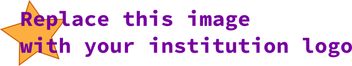

# Welcome to the Example Discipline

{width=300}

Write here a short description of the discipline, something more for motivational/marketing than bureaucratic.

- **INSTITUTION NAME**
- **DEPARTMENT/ COURSE**
- **DISCIPLNE NAME**
    - SEMESTER/ YEAR
- **Prof.** YOUR NAME / YOUR@EMAIL.COM
- **Local:** LAB/ CLASSROOM/ TEAMS/...
- **Course meetings:** INFORMATION ABOUT COURSE MEETINGS (DAY/ TIME)

------------------------

Course Description: Here you should write more details about the course, we sugest the fallowing sections, you can organize it according to your needs and taste. 

You can put a photo that illustrates the course, we suggest something more for the end of the semester, so that students understand where they are going with the course.

If you have a video that describes the course, here is the place to use.

## Learning objectives:

If your course is created with learning objectives, detail them here, if not, use the section to summarize the course's contribution to the student's education.

1. First course objective
1. Second 
1. Third course objective

## Metodology

Detail the format of the class and the methodology that will be used in the course, this will be useful both for the student who will read about the course and for others who access the material. Writing about the methodology makes us reflect on the classes.

You can describe projects, activities, and other things you find interesting.

## Assessment

This session is very important, it will be the most consulted part of this page by students, be clear and if necessary make use of tables and formulas.

## Infrastructure 

Many courses require prior preparation, which may involve installing software, purchasing material, ... . Detail here what the student should know about this part. 

- Install [software 1]()
- Bring your notebook

## Bibliography

List the course bibliography, here some examples on how to do it:

Basic

- [HALLINAN, 2007] HALLINAN, C. Embedded Linux primer: a practical, real-world approach. Pearson Education India, 2007.
- [DESCHAMPS, 2012] DESCHAMPS,  J. P.;  SUTTER, G. D.;  CANTÓ E. Guide to FPGA implementation of arithmetic functions. Springer Science & Business Media; 2012, Apr 5.
- ...
    
Extra

- [SASS, 2010] SASS, R., SCHMIDT, A.G.; Embedded Systems Design with Platform FPGAs: Principles and Practices. Elsevier, 2010.
    - ...
